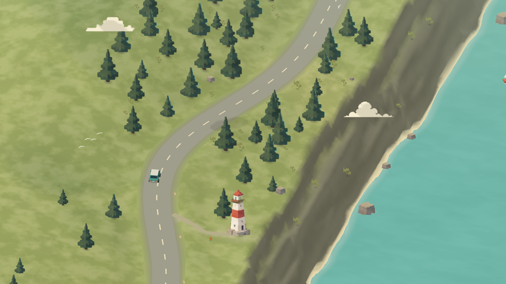
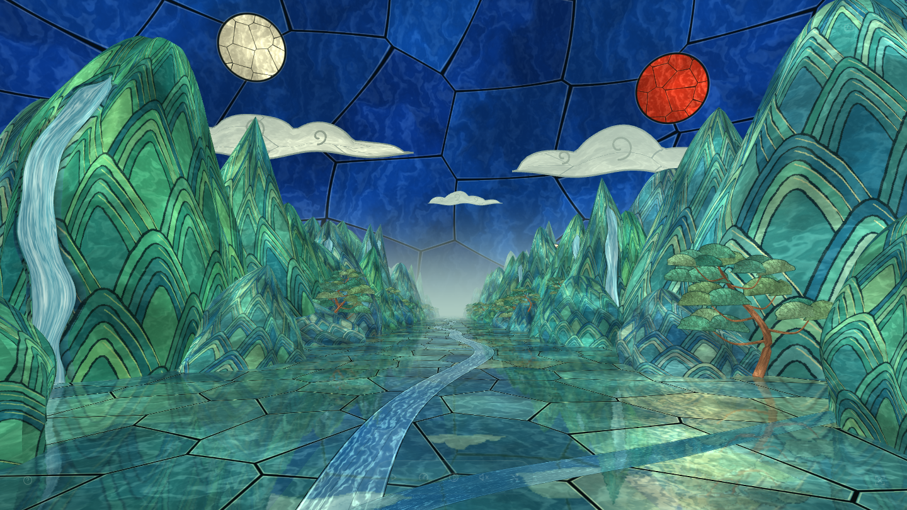
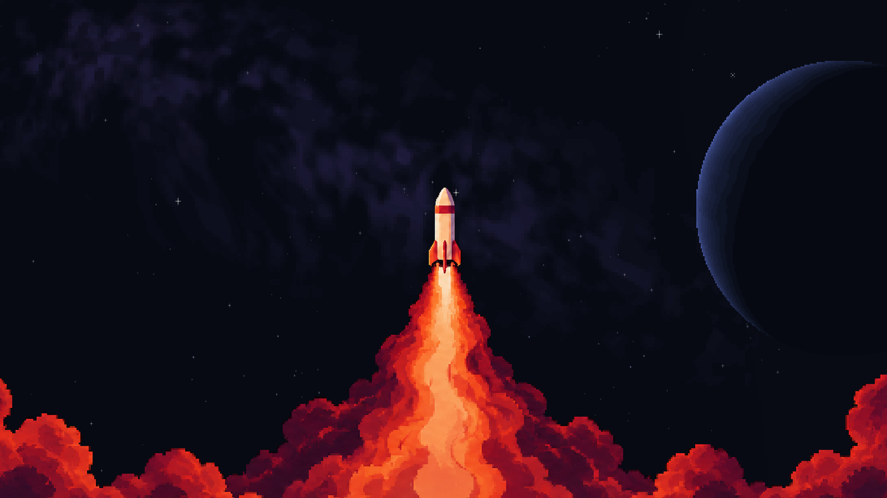

# Ambient Worlds

**[라이브 사이트 보기 · Open live site](https://ambient-worlds.pages.dev/)**

[한국어](#한국어) · [English](#english)

<table>
  <tr>
    <th width="50%" scope="col">Journey</th>
    <th width="50%" scope="col">Stillwater</th>
  </tr>
  <tr>
    <td width="50%"></td>
    <td width="50%"></td>
  </tr>
  <tr>
    <th width="50%" scope="col">Glass Valley</th>
    <th width="50%" scope="col">Quiet Ascent</th>
  </tr>
  <tr>
    <td width="50%"></td>
    <td width="50%"></td>
  </tr>
</table>

---

## 한국어

> 평화로운 풍경을 감상할 수 있는 비주얼 플레이어입니다.

명상, 집중, 휴식 또는 조용한 배경이 필요할 때 재생해 보세요.

사람의 아트 디렉션과 선택을 바탕으로 GPT와 협업을 통해 만들었습니다.

비슷한 프로젝트를 만들고 싶은 분들에게 도움이 되기를 바랍니다.

---

## English

> A visual player for peaceful landscapes.

Play it for meditation, focus, rest, or a quiet background.

Made in collaboration with GPT, guided by human art direction and selection.

We hope it helps others create similar projects of their own.

---

[외부 자료·라이선스 / Third-party notices](THIRD_PARTY_NOTICES.md)
