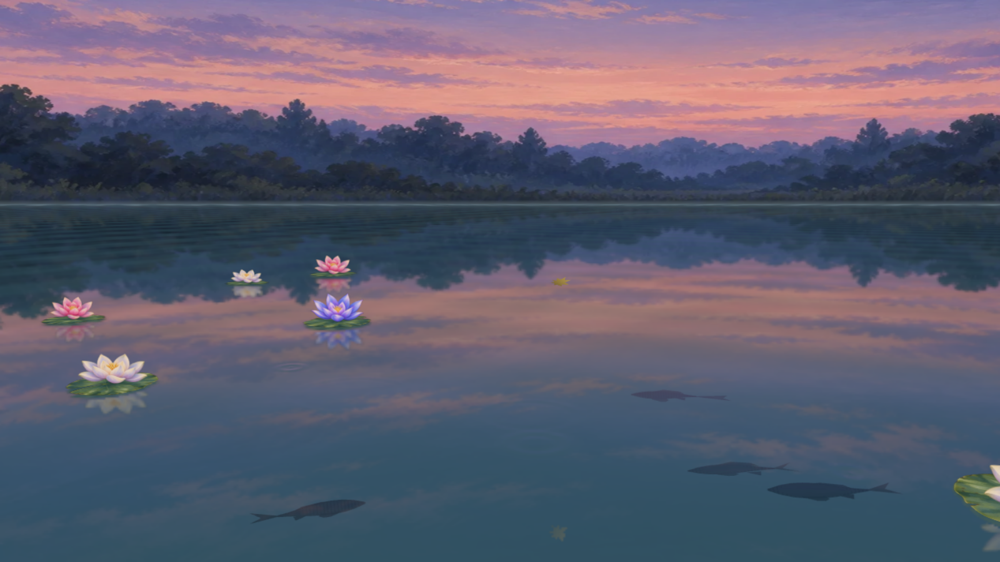

# Ambient Worlds

| Journey | Stillwater | Glass Valley |
| --- | --- | --- |
|  |  |  |

[한국어](#한국어) · [English](#english)

## 한국어

평화로운 풍경을 감상할 수 있는 비주얼 플레이어입니다.

명상, 집중, 휴식 또는 조용한 배경이 필요할 때 재생해 보세요.

**[라이브 사이트 보기 · Open live site](https://ambient-worlds.pages.dev/)**

사람의 아트 디렉션과 선택을 바탕으로 GPT와 협업을 통해 만들었습니다.

- **Journey** — 해안, 사막, 황혼 테마를 오가며, 아이소메트릭 시점에서 달리는 자동차를 중심으로 풍경이 이어지는 장면
- **Stillwater** — 물, 빛, 식물과 물고기가 움직이는 고요한 연못 풍경
- **Glass Valley** — 민화식 스테인드글라스 계곡을 따라 전진하며 좌우를 둘러볼 수 있는 무음 풍경

비슷한 프로젝트를 만들고 싶은 분들에게 도움이 되기를 바랍니다.

## English

A visual player for peaceful landscapes.

Play it for meditation, focus, rest, or a quiet background.

Made in collaboration with GPT, guided by human art direction and selection.

- **Journey** — an isometric drive through shifting coastal, desert, and dusk landscapes, centered on a moving car
- **Stillwater** — a quiet pond landscape where water, light, plants, and fish move together
- **Glass Valley** — a silent journey through a stained-glass valley inspired by Korean folk painting, with drag-to-look views

We hope it helps others create similar projects of their own.

Third-party credits and licenses are listed in [THIRD_PARTY_NOTICES.md](THIRD_PARTY_NOTICES.md).
