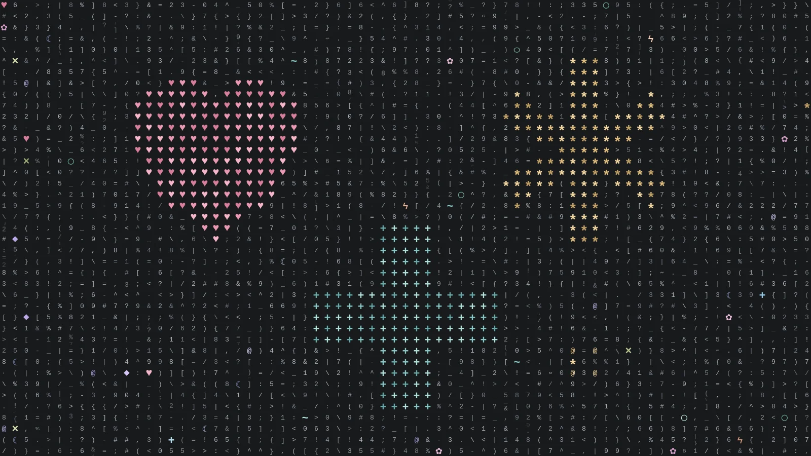
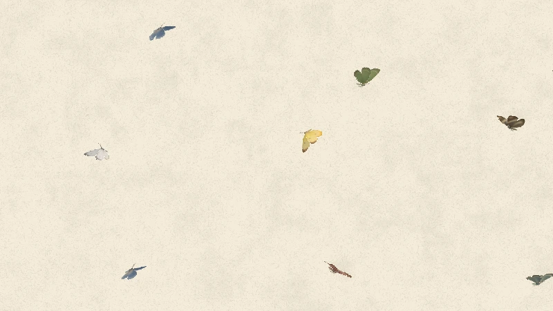
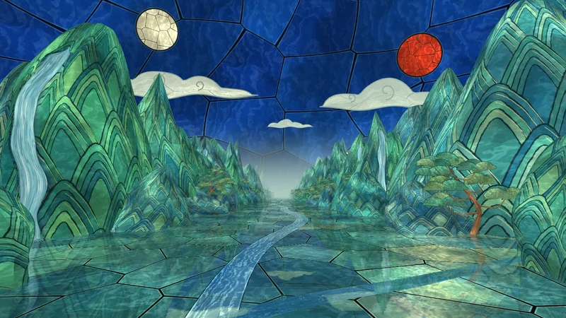
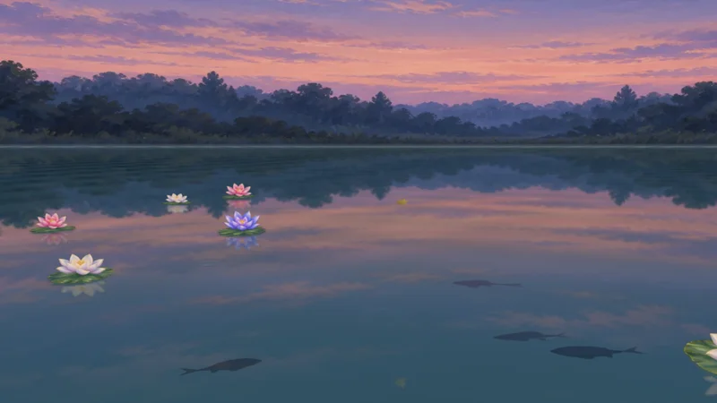
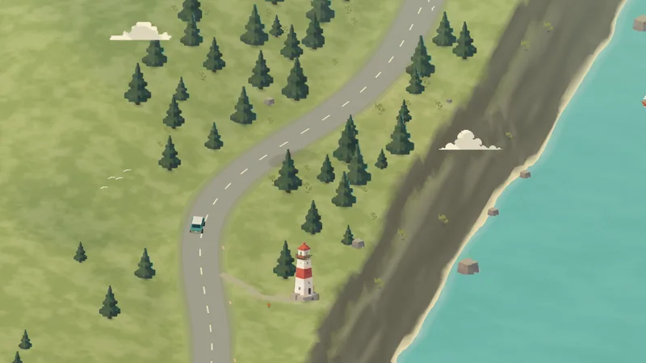

# Daydream Gallery

**[라이브 사이트 보기 · Open live site](https://daydream-gallery.pages.dev/)**

[한국어](#한국어) · [English](#english)

<!-- docs:gallery:start -->
<table>
  <tr><th colspan="2" scope="col">ASCII Bloom</th></tr>
  <tr><td colspan="2"></td></tr>
  <tr><th width="50%" scope="col">Paper Wings</th><th width="50%" scope="col">White Sands</th></tr>
  <tr><td width="50%"></td><td width="50%"></td></tr>
  <tr><th width="50%" scope="col">Glass Valley</th><th width="50%" scope="col">Quiet Ascent</th></tr>
  <tr><td width="50%"></td><td width="50%"></td></tr>
  <tr><th width="50%" scope="col">Stillwater</th><th width="50%" scope="col">Journey</th></tr>
  <tr><td width="50%"></td><td width="50%"></td></tr>
</table>
<!-- docs:gallery:end -->

---

## 한국어

> 만들고 싶은 장면을 만들어 모아두는 개인 갤러리입니다.

마음에 드는 작품을 골라 감상해 보세요.

사람의 아트 디렉션과 선택을 바탕으로 GPT와 협업을 통해 만들었습니다.

비슷한 프로젝트를 만들고 싶은 분들에게 도움이 되기를 바랍니다.

### 사용 방법

<!-- docs:controls-ko:start -->
홈의 이미지를 눌러 장면을 엽니다. 상단 집 아이콘은 홈으로, 이미지 목록 아이콘은 다른 장면으로 이동합니다. 하단에서 새로운 장면 보기, 재생·정지, 소리, 화면만 보기를 선택할 수 있습니다.

소리는 처음에 꺼져 있습니다. 스피커 버튼이나 M으로 켜면 모든 장면에서 같은 32초 BGM이 반복됩니다. 장면을 바꿔도 재생 위치는 유지됩니다. 정지·음소거·홈 이동·숨겨진 탭에서는 음악도 멈추고, 다시 재생하면 같은 위치에서 이어집니다.

Space는 재생·정지, R은 새로운 장면, M은 소리, F 또는 Esc는 컨트롤 숨기기입니다. 숫자 키는 화면 목록 순서대로 장면을 선택합니다. 3초 동안 조작하지 않으면 컨트롤이 숨으며, 클릭·탭·Tab 또는 지원하는 단축키로 다시 표시합니다. 포인터 이동만으로는 나타나지 않습니다.

ASCII Bloom에서는 하단에서 모양과 색을 고른 뒤 화면을 클릭하거나 탭할 수 있습니다. 장면 목록에서는 방향키로 이동하고 Enter로 선택하며 Esc로 닫습니다. 장면 주소는 새로고침과 브라우저 뒤로가기를 지원합니다.
<!-- docs:controls-ko:end -->

---

## English

> A personal gallery of things I wanted to make.

Choose a piece and spend some time with it.

Made in collaboration with GPT, guided by human art direction and selection.

We hope it helps others create similar projects of their own.

### Controls

<!-- docs:controls-en:start -->
Choose an image on the home screen to open a scene. Use the home icon to return or the image-list icon to select another scene. The bottom controls offer a new scene, play/pause, sound and a view without controls.

Sound starts muted. Press the speaker button or M to play the same 32-second BGM loop in every scene. Switching scenes keeps the playback position. Pause, mute, returning home or hiding the tab pauses the music; resuming continues from that position.

Space toggles playback, R creates a new scene, M toggles sound, and F or Esc hides the controls. Number keys select scenes in menu order. Controls hide after three idle seconds. Click, tap, Tab or a supported shortcut reveals them; pointer movement alone does not.

In ASCII Bloom, choose a shape and color in the bottom bar, then click or tap the scene. In the scene picker, use arrow keys to move, Enter to select and Esc to close. Scene links support reload and browser Back.
<!-- docs:controls-en:end -->

---

[외부 자료·라이선스 / Third-party notices](THIRD_PARTY_NOTICES.md)
